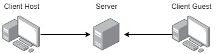

# Red Remote
Simple Remote Access Software Easy to Embed Into Any Application

This project is in early development

# What is Red Remote
Red Remote is a Remote Access Software intended to be simple and easy to embed on third part applications, small but still usefull. It is composed by a client host (the machine to be remotelly controlled) a server and a client viewer to control the host machine.

# How does it work?
Both the server and the client host are Python applications and the client viewer is an Angular project. The communications occurs using websocket and the Red Remote protocol described in the protocol folder in this repository.

Both the client host and the client viewer must have a client id, this client id is an UUID that can be static or dinamically created. To connect to a host the viewer must have the host's client ID and its password.

The host machine must be connected to the server before the client viewer, once there is a machine connected to the host it'll start sharing their screen.

# How to run it?
Each project folder contains a README with more details about how to run it.

# License
MIT License

Copyright (c) 2021 Felipe Durar

Permission is hereby granted, free of charge, to any person obtaining a copy
of this software and associated documentation files (the "Software"), to deal
in the Software without restriction, including without limitation the rights
to use, copy, modify, merge, publish, distribute, sublicense, and/or sell
copies of the Software, and to permit persons to whom the Software is
furnished to do so, subject to the following conditions:
